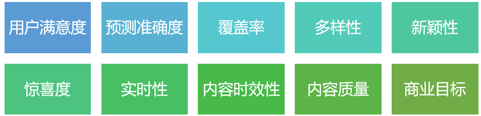
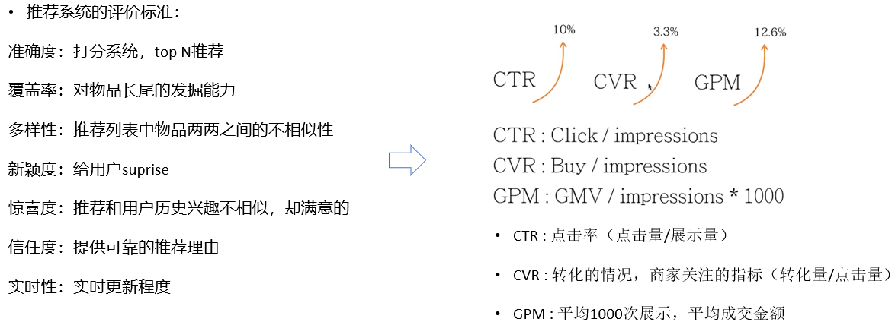
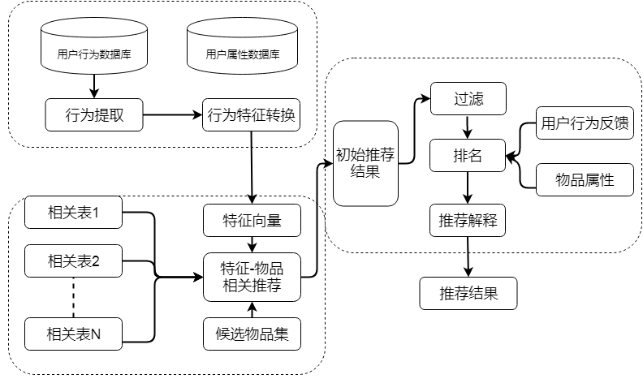

+ 推荐系统是一种信息过滤系统，根据用户的历史行为、社交关系、兴趣点，算法可以判断用户当前感兴趣的物品或内容。
+ **content-based filtering**（基于内容的推荐算法，最早使用的推荐算法。根据物品属性为他们打上标签，计算标签相似度）
+ **collaborative filtering**(协同过滤)，协同过滤是通过数据找到与你相似的用户，根据他们的行为和他们喜欢的内容为你推荐你可能感兴趣的物品或内容
+ **用户行为**包含显性反馈数据和隐性反馈数据，显性反馈数据是用户明确表示对物品的喜欢行为：评分、喜欢、收藏、购买。隐性反馈数据不能明确反映用户喜好的行为:浏览、停留时间、点击。
+ **如何评判相似**？有两种方法，一是**user-based**，两个人共同喜欢的东西越多，那么两个人越相似。二是**item-based**，两个物品，共同喜欢的人越多，这两个物品越相似
+ **如何进行推荐？userCF**，和你兴趣相投的用户，推荐他们喜欢的商品。**itemCF**，给用户推荐他们之前喜欢商品的类似商品。
+ **推荐系统的冷启动问题**，新用户来的时候如何推荐？新的物品如何推荐？新网站上线如何推荐
+ **EE问题（exploit & explore）**
+ **Bandit算法解决冷启动问题**。如果用户对推荐的某个topic感兴趣，就代表获得了收益，否则就表示遗憾，通过“选择-观察-更新-选择”的循环将收益最大化。通过几次试验，刻画新用户心中对每个topic感兴趣概率。
+ Bandit算法包括：Epsilon-Greedy，Thompson sampling，UCB，LinUCB
+ **推荐系统的目标定义**：

+ 推荐系统流程：

       1. 数据源--   item特征、用户画像、用户行为
          2. 召回阶段--  粗晒，得到候选物品集
          3. 排序阶段--   对多个召回通道的内容进行排序打分，选出最优的少量结果。兼顾推荐系统的多维度指标：覆盖率、多样性、新颖度

+ 一切源于需求，不是所有系统都需要推荐系统。一个创业项目刚开始启动，用户数在1000人，item在1万，就不需要推荐算法。

